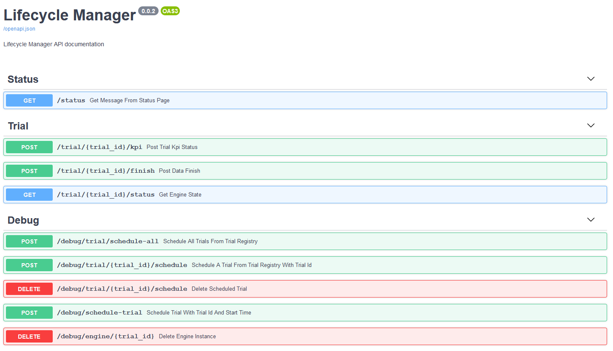

# Lifecycle Manager
Lifecycle Manager is a sub-module, which is responsible for managing the lifecycle of the trial
and handling stream of information between sources.

Lifecycle Manager contains two main part to care trials, Schedule and Executor.
The specific information and functionalities of these two parts are introduced their README in their folder
(Scheduler README: */src/lifecycle_manager/scheduler/README*
and Executor README: */src/lifecycle_manager/executor/README*).

## How to run Lifecycle Manager

### Before running
- Change SECRET and API_KEY values from /src/lifecycle_manager/api_customization.py
- Change root path if reverse proxy is used in front of lcm instance in api_customization.py

Configure LCM with /src/lifecycle_manager/config/services.py
- Set up urls and ports for each service of the trial controller
- Check facility mapping

Authentication:
-Requests to LCM should include {"Authorization": <key/token>} in headers or cookies.

- Change SECRET and API_KEY values from /src/lifecycle_manager/api_customization.py
- 
	-API_KEY is used to access resources in the LCM so treat it like a password!
	-SECRET is used to verify authenticity of tokens used in callback requests.

- Set up HTTPBasic authentication with either username and password or apikey.

TLS in Executor: 
- Setup service URL:s accordingly ("https://.....")

TLS to LCM API:
- Set up with a reverse proxy eg. NGINX

## Requirements 
Install Python 3.8.x:
- https://www.python.org/downloads/

Install Docker for Windows:
- https://docs.docker.com/docker-for-windows/install/

Install Docker for Mac:
- https://docs.docker.com/docker-for-mac/install/

Install Docker for Linux:
- See your distribution instructions

### Option 1. Development Natively
Clone or download the project from the repository.

Open terminal window in the working directory and install dependencies by using command
- `pip install -r ./src/requirements.txt`

Run the project in development server
- `cd src`
- `python -m lifecycle_manager.app`

Open browser and locate to http://localhost:5000/. There should be appeared the swagger document of the project.

### Option 2. Build and runs as Docker image (Recommended)
Clone or download the project from the repository.

Open terminal window in the working directory and build docker image from the project.
- `docker build -t lcm:latest .`
- `docker run -it -d -p 5000:5000 lcm:latest`

Open browser and locate to http://localhost:5000/. There should be appeared the swagger document of the project with the same view as in the previous image.

## Run Unit test
To check the project run properly, run the unit tests locally. Open terminal window in the working directory and run tests by using command

- `pytest` or `python -m pytest`

## License

5G!Drones Lifecycle manager is licensed under Apache 2.0. For more information, see the LICENSE.

## Authors
Special thanks to project consortium members, who helped in creating, integrating and testing the trial engine of the 5G!Drones project! (https://5gdrones.eu/consortium/)

Authors:
Joonas Pulkkinen (joopulkkin) - Executor/engine Development, documentation, integration to project, releasing.
Katri Pihlajaviita (kpihlaja) - Scheduler developmnet, documentation
Riikka Valkama (rvalkama) - API development, documentation
Ilkka känsälä (ikansala) - Trial sequence, integration

## 5G!Drones (https://5gdrones.eu/)

This project has received funding from the European Union’s Horizon 2020 research and innovation programme under grant agreement No857031

